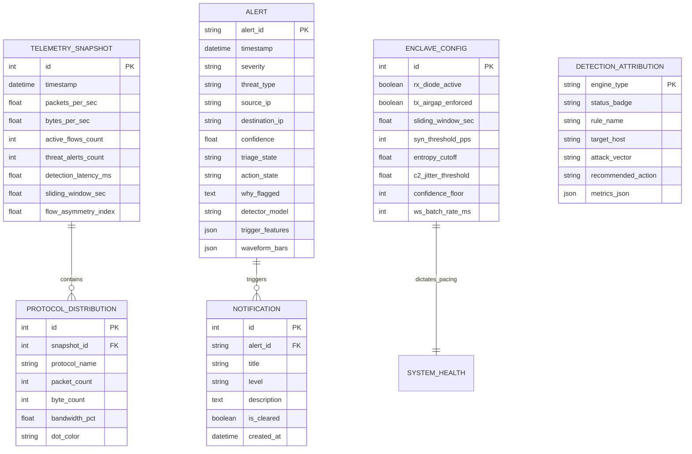

# Backend Architecture & System Design
**ShieldX SOC — Unidirectional Hardware Enclave Defense Backend**

---

## 1. System Overview & Technology Stack

The ShieldX backend serves as the high-throughput ingestion, persistence, aggregation, and real-time dissemination layer for the ShieldX Security Operations Center (SOC) dashboard. 

### Explicit Non-Scope (Detector Boundary)
Per strict architectural separation, **the backend does NOT perform:**
- DDoS detection algorithms, SYN flood detection, or asymmetry calculation
- C2 beaconing analysis, inter-arrival cadence, or jitter modeling
- DGA or Shannon entropy evaluation on DNS queries
- Zeek deep packet inspection or packet frame capture
- ML inference, feature extraction, or model training

The backend's sole role is to **validate, store, aggregate, query, and broadcast** detection results and sliding-window telemetry produced by the external Zeek and ML detection pipeline.

### Technology Stack
- **Language / Runtime:** Python 3.11+
- **API Framework:** FastAPI (Asynchronous ASGI)
- **Validation & Serialization:** Pydantic v2
- **ORM / Persistence:** SQLAlchemy 2.0 (Declarative Mapping, AsyncEngine with `aiosqlite`)
- **Database Engine:** SQLite (Local high-performance file-backed WAL mode)
- **Real-Time Transport:** WebSockets (`fastapi.WebSocket` with `ConnectionManager`)
- **Server:** Uvicorn (ASGI HTTP/WebSocket server)
- **Testing:** pytest with `pytest-asyncio` and `httpx`

---

## 2. Directory Structure

```
backend/
├── app/
│   ├── __init__.py
│   ├── main.py                  # FastAPI app factory, lifespan, CORS, router inclusion
│   ├── config.py                # Pydantic BaseSettings & environment loading
│   ├── api/
│   │   ├── __init__.py
│   │   ├── deps.py              # DB session & auth dependencies
│   │   ├── v1/
│   │   │   ├── __init__.py
│   │   │   ├── router.py        # Central v1 APIRouter aggregator
│   │   │   ├── alerts.py        # /alerts endpoints (queue, detail, triage, export)
│   │   │   ├── traffic.py       # /traffic endpoints (timeseries, protocol composition)
│   │   │   ├── detections.py   # /detections endpoints (DDOS, C2, DGA telemetry)
│   │   │   ├── health.py        # /health & /integrity endpoints
│   │   │   ├── config.py        # /config endpoints (enclave settings)
│   │   │   ├── search.py        # /search universal lookup
│   │   │   └── ai_analyst.py    # /ai-analyst endpoints
│   ├── models/                  # SQLAlchemy 2.0 ORM entities
│   │   ├── __init__.py
│   │   ├── base.py              # DeclarativeBase with common timestamp mixins
│   │   ├── alert.py             # AlertEntity & AlertEvidence
│   │   ├── telemetry.py         # TelemetrySnapshotEntity & ProtocolDistributionEntity
│   │   ├── detection.py         # DetectionAttributionEntity
│   │   ├── health.py            # SystemHealthEntity & DiodeIntegrityEntity
│   │   ├── config.py            # EnclaveConfigEntity
│   │   └── notification.py      # NotificationEntity
│   ├── schemas/                 # Pydantic v2 validation contracts
│   │   ├── __init__.py
│   │   ├── alert.py             # Ingest, query, detail, and triage schemas
│   │   ├── traffic.py           # Timeseries, sparkline, and protocol schemas
│   │   ├── detection.py         # DDoS, C2, DGA attribution schemas
│   │   ├── health.py            # Gauges, sensor network, diode integrity schemas
│   │   ├── config.py            # Enclave configuration schemas
│   │   ├── search.py            # Global search schemas
│   │   └── websocket.py         # WS broadcast message contracts
│   ├── services/                # Business logic & repository mediation
│   │   ├── __init__.py
│   │   ├── alert_service.py     # Filter, sort, paginate, mutate triage state
│   │   ├── traffic_service.py   # Window aggregation, rolling timeseries
│   │   ├── detection_service.py # Engine state retrieval & attributions
│   │   ├── health_service.py    # Sensor checks, hardware diode verification
│   │   ├── config_service.py    # Enclave parameter sync & persistence
│   │   └── search_service.py    # Universal IP/domain/alert lookup
│   ├── websocket/               # Real-time connection management
│   │   ├── __init__.py
│   │   ├── manager.py           # ConnectionManager (connect, disconnect, broadcast)
│   │   └── router.py            # WebSocket endpoint (/api/v1/ws/telemetry)
│   └── db/
│       ├── __init__.py
│       ├── session.py           # Async sessionmaker & engine initialization
│       └── init_db.py           # Table creation & initial baseline seed data
├── scripts/
│   ├── seed_data.py             # CLI script to seed realistic demo data
│   └── simulate_feed.py         # Background worker pushing synthetic diode ticks
├── tests/
│   ├── __init__.py
│   ├── conftest.py              # In-memory test DB fixtures & test client
│   ├── test_alerts.py           # Alerts API tests
│   ├── test_traffic.py          # Traffic metrics tests
│   ├── test_config.py           # Settings sync tests
│   └── test_websocket.py        # WS live stream tests
├── ARCHITECTURE.md              # Architectural blueprint (this document)
├── requirements.txt             # Production & development dependencies
└── README.md                    # Setup & operational instructions
```

---

## 3. Database Entities & Relationships

### 3.1 Entity Definitions (SQLAlchemy 2.0 Declarative)

#### `AlertEntity` (`alerts` table)
| Column | Type | Constraints / Modifiers | Description |
|---|---|---|---|
| `alert_id` | String(64) | Primary Key, Index | Unique alert identifier (e.g. `alt-ddos-8901`) |
| `timestamp` | DateTime(timezone=True) | Index, Not Null | Detection time in UTC |
| `time_formatted` | String(16) | Not Null | Pre-formatted display time (`05:11:12`) |
| `date_label` | String(32) | Not Null | Relative date label (`Today`, `Yesterday`) |
| `severity` | String(16) | Index, Not Null | `CRITICAL`, `HIGH`, `MEDIUM`, `LOW` |
| `threat_type` | String(32) | Index, Not Null | `DDOS`, `C2_BEACONING`, `DGA_DNS_TUNNEL`, `ANOMALY` |
| `source_ip` | String(45) | Index, Not Null | Ingress source IP address |
| `source_port` | Integer | Nullable | Ingress source port |
| `destination_ip` | String(45) | Index, Not Null | Protected enclave target IP |
| `destination_port`| Integer | Nullable | Protected enclave target port |
| `protocol` | String(32) | Not Null | Display protocol string (e.g. `TCP : 443`) |
| `confidence` | Float | Not Null | Confidence score (0.0 to 1.0) |
| `confidence_pct` | Float | Not Null | Percentage representation (`98.0`) |
| `triage_state` | String(32) | Index, Not Null | `NEW`, `INVESTIGATING`, `ESCALATED`, `RESOLVED`, `FALSE_POSITIVE` |
| `action_state` | String(32) | Not Null | `Mitigated`, `Blocked`, `Alerted`, `Monitored` |
| `why_flagged` | Text | Not Null | Plain-text explainability statement |
| `detector_model` | String(64) | Not Null | Detector model name (e.g. `Ensemble-Volumetric-SYN-Burst`) |
| `mitre_technique_id`| String(32) | Nullable | MITRE ATT&CK identifier (`T1498.001`) |
| `mitre_tactic` | String(64) | Nullable | MITRE tactic (`Impact`, `Command and Control`) |
| `trigger_features` | JSON | Not Null | Dictionary of engineered feature triggers |
| `waveform_bars` | JSON | Not Null | Array of relative histogram heights (0–100) |
| `raw_packet_snippet` | Text | Nullable | Hexdump / decoded snippet for inspector drawer |
| `created_at` | DateTime(timezone=True) | Default UTC now | Row creation timestamp |
| `updated_at` | DateTime(timezone=True) | On update UTC now | Last state mutation timestamp |

#### `TelemetrySnapshotEntity` (`telemetry_snapshots` table)
| Column | Type | Constraints / Modifiers | Description |
|---|---|---|---|
| `id` | Integer | Primary Key, Autoincrement | Snapshot sequence ID |
| `timestamp` | DateTime(timezone=True) | Index, Not Null | Telemetry capture window UTC |
| `packets_per_sec` | Float | Not Null | Current ingress packet rate |
| `bytes_per_sec` | Float | Not Null | Current ingress bandwidth |
| `active_flows_count`| Integer | Not Null | Zeek concurrent tracked flows |
| `threat_alerts_count`| Integer | Not Null | Active alert total |
| `threat_alerts_critical`| Integer | Not Null | Active critical alerts |
| `detection_latency_ms`| Float | Not Null | Enclave pipeline latency |
| `sliding_window_sec`| Float | Default 10.0 | Zeek inspection sliding window |
| `flow_asymmetry_index`| Float | Default 1.0 | Unidirectional ratio (1.0 = Pure Ingress) |
| `dns_qps` | Float | Not Null | DNS queries per second |
| `is_anomaly` | Boolean | Default False | Flag if rate exceeds dynamic baseline |

#### `ProtocolDistributionEntity` (`protocol_distributions` table)
| Column | Type | Constraints / Modifiers | Description |
|---|---|---|---|
| `id` | Integer | Primary Key, Autoincrement | Distribution record ID |
| `snapshot_id` | Integer | ForeignKey(`telemetry_snapshots.id`) | Owning snapshot reference |
| `protocol_name` | String(16) | Not Null | `TCP`, `UDP`, `DNS`, `ICMP` |
| `packet_count` | Integer | Not Null | Observed packets in window |
| `byte_count` | Integer | Not Null | Observed bytes in window |
| `bandwidth_pct` | Float | Not Null | Share percentage (e.g. 68.5) |
| `dot_color` | String(16) | Not Null | Hex color for UI representation |

#### `DetectionAttributionEntity` (`detection_attributions` table)
| Column | Type | Constraints / Modifiers | Description |
|---|---|---|---|
| `engine_type` | String(16) | Primary Key | `DDOS`, `C2`, `DGA` |
| `status_badge` | String(32) | Not Null | `ACTIVE THREAT`, `1 BEACON`, `ENTROPY SPIKE` |
| `rule_name` | String(64) | Not Null | Rule or model attribution |
| `target_host` | String(64) | Not Null | Affected IP or endpoint |
| `attack_vector` | String(64) | Not Null | Specific vector or external C2 node |
| `cadence_or_duration`| String(64) | Not Null | Metric statement (e.g. `45.2s (Jitter ±0.08s)`) |
| `recommended_action`| String(128) | Not Null | Operator playbook recommendation |
| `metrics_json` | JSON | Not Null | Engine-specific telemetry curves and thresholds |
| `updated_at` | DateTime(timezone=True) | Default UTC now | Last attribution refresh |

#### `EnclaveConfigEntity` (`enclave_configs` table — Singleton Row ID=1)
| Column | Type | Constraints / Modifiers | Description |
|---|---|---|---|
| `id` | Integer | Primary Key, Value=1 | Singleton identifier |
| `rx_diode_active` | Boolean | Default True | Optical RX Ingress Tap status |
| `tx_airgap_enforced`| Boolean | Default True | Physical TX laser severed flag |
| `ring_buffer_size_mb`| Integer | Default 4096 | Zero-copy kernel buffer size |
| `sliding_window_sec`| Float | Default 10.0 | Zeek statistical window (5.0–30.0s) |
| `track_tcp` | Boolean | Default True | Track TCP protocol |
| `track_udp` | Boolean | Default True | Track UDP protocol |
| `track_dns` | Boolean | Default True | Track DNS protocol |
| `track_icmp` | Boolean | Default True | Track ICMP protocol |
| `syn_threshold_pps`| Integer | Default 5000 | SYN flood alert cutoff |
| `entropy_cutoff` | Float | Default 1.12 | Ingress IP Shannon entropy floor |
| `c2_jitter_threshold`| Float | Default 2.4 | Beacon jitter detection floor (%) |
| `confidence_floor` | Integer | Default 85 | Minimum ensemble confidence (%) |
| `ws_batch_rate_ms` | Integer | Default 1000 | WebSocket push interval (500, 1000, 2000) |
| `zstd_compression` | Boolean | Default True | Compression enabled flag |
| `sound_alerts` | Boolean | Default True | Audible siren enabled |
| `auto_escalate_critical`| Boolean | Default False | Auto-escalate 98%+ surge threats |
| `updated_at` | DateTime(timezone=True) | On update UTC now | Last configuration sync time |

#### `NotificationEntity` (`notifications` table)
| Column | Type | Constraints / Modifiers | Description |
|---|---|---|---|
| `id` | Integer | Primary Key, Autoincrement | Notification ID |
| `alert_id` | String(64) | ForeignKey(`alerts.alert_id`), Nullable | Linked alert |
| `title` | String(128) | Not Null | Alert summary header |
| `description` | Text | Not Null | Short contextual explanation |
| `level` | String(16) | Not Null | `critical`, `high`, `medium`, `info` |
| `created_at` | DateTime(timezone=True) | Default UTC now | Notification trigger time |
| `is_cleared` | Boolean | Default False | Operator cleared status |

---

### 3.2 Entity Relationship Diagram (ERD)



---

## 4. Pydantic v2 Request & Response Schemas

### 4.1 Ingestion Schemas (Passive Ingress into Backend)
```python
from pydantic import BaseModel, Field
from typing import Dict, Any, List, Optional
from datetime import datetime

class AlertIngestSchema(BaseModel):
    alert_id: str = Field(..., example="alt-ddos-8901")
    timestamp: datetime
    severity: str = Field(..., pattern="^(CRITICAL|HIGH|MEDIUM|LOW)$")
    threat_type: str = Field(..., pattern="^(DDOS|C2_BEACONING|DGA_DNS_TUNNEL|ANOMALY)$")
    source_ip: str
    source_port: Optional[int] = None
    destination_ip: str
    destination_port: Optional[int] = None
    protocol: str
    confidence_score: float = Field(..., ge=0.0, le=1.0)
    why_flagged: str
    detector_model: str
    mitre_technique_id: Optional[str] = None
    mitre_tactic: Optional[str] = None
    trigger_features: Dict[str, Any]
    raw_packet_snippet: Optional[str] = None

class TelemetryTickIngestSchema(BaseModel):
    timestamp: datetime
    packets_per_sec: float
    bytes_per_sec: float
    active_flows_count: int
    threat_alerts_count: int
    threat_alerts_critical: int
    detection_latency_ms: float
    sliding_window_sec: float = 10.0
    flow_asymmetry_index: float = 1.0
    dns_qps: float
    dns_surge_pct: Optional[float] = 0.0
    is_anomaly: bool = False
    protocols: List[Dict[str, Any]]
```

### 4.2 Client Query & Mutation Request Schemas
```python
class AlertTriageUpdateSchema(BaseModel):
    triage_state: Optional[str] = Field(None, pattern="^(NEW|INVESTIGATING|ESCALATED|RESOLVED|FALSE_POSITIVE)$")
    action_state: Optional[str] = Field(None, pattern="^(Mitigated|Blocked|Alerted|Monitored)$")
    notes: Optional[str] = None

class EnclaveConfigUpdateSchema(BaseModel):
    sliding_window_sec: Optional[float] = Field(None, ge=5.0, le=30.0)
    ring_buffer_size_mb: Optional[int] = Field(None, pattern="^(2048|4096|8192)$")
    track_protocols: Optional[Dict[str, bool]] = None
    syn_threshold_pps: Optional[int] = Field(None, ge=1000, le=15000)
    entropy_cutoff: Optional[float] = Field(None, ge=0.5, le=3.0)
    c2_jitter_threshold: Optional[float] = Field(None, ge=0.5, le=10.0)
    confidence_floor: Optional[int] = Field(None, ge=60, le=99)
    ws_batch_rate_ms: Optional[int] = Field(None, pattern="^(500|1000|2000)$")
    zstd_compression: Optional[bool] = None
    sound_alerts: Optional[bool] = None
    auto_escalate_critical: Optional[bool] = None
```

### 4.3 Client Response Schemas (Frontend Contract Match)
```python
class IncidentItemResponse(BaseModel):
    id: str
    severity: str
    time: str
    dateLabel: str
    classification: str
    srcIp: str
    destIp: str
    confidence: int
    confidenceFormatted: str
    triage: str
    triageType: str
    accentColor: str
    whyFlagged: str
    detectorModel: str
    protocol: str
    mitre: str
    triggerFeatures: Dict[str, Any]

class IncidentQueueResponse(BaseModel):
    total: int
    counts: Dict[str, int]
    items: List[IncidentItemResponse]

class TrafficTimeSeriesResponse(BaseModel):
    range: str
    timestamps: List[str]
    packetsPath: str
    packetsFill: str
    bytesPath: str
    bytesFill: str
    anomalies: List[Dict[str, Any]]

class ProtocolCompositionItem(BaseModel):
    name: str
    dotColor: str
    barGradient: str
    packets: str
    bytes: str
    pct: float

class ThreatDistributionCategory(BaseModel):
    label: str
    pct: str
    count: int
    color: str

class SystemHealthResponse(BaseModel):
    status: str
    gauges: List[Dict[str, Any]]
    sources: List[Dict[str, Any]]
    sensor_network: Dict[str, Any]

class IntegrityResponse(BaseModel):
    timestamp: str
    diode: Dict[str, Any]
    zeek: Dict[str, Any]
    pipeline_latency_ms: float
    tamper_evident_chain_valid: bool
    last_audit_hash: str
```

---

## 5. REST Endpoints Specification

| Method | Endpoint | Query / Body Params | Response Status & Model | Purpose |
|---|---|---|---|---|
| `GET` | `/api/v1/alerts` | `severity`, `search`, `triage`, `page`, `page_size`, `sort_by`, `sort_dir` | `200 OK` → `IncidentQueueResponse` | Paginated, filtered incident queue |
| `GET` | `/api/v1/alerts/{id}` | Path: `id` | `200 OK` → `IncidentItemResponse` / `404` | Deep packet evidence & inspector data |
| `PATCH` | `/api/v1/alerts/{id}/triage` | Body: `AlertTriageUpdateSchema` | `200 OK` → `IncidentItemResponse` | Mutate triage lifecycle or action state |
| `GET` | `/api/v1/alerts/distribution` | `filter_mode` | `200 OK` → `List[ThreatDistributionCategory]` | Threat classification donut data |
| `GET` | `/api/v1/alerts/export` | `severity`, `search` | `200 OK` → `text/csv` stream | Export filtered incidents to CSV |
| `GET` | `/api/v1/traffic/timeseries` | `range` (`5 min`, `15 min`, `1 hour`, `24 hours`) | `200 OK` → `TrafficTimeSeriesResponse` | Dual-axis live rate chart dataset |
| `GET` | `/api/v1/traffic/protocol-composition` | `window_sec` (default 10.0) | `200 OK` → `List[ProtocolCompositionItem]` | Protocol table & bandwidth share |
| `GET` | `/api/v1/detections/{engine}` | Path: `engine` (`DDOS`, `C2`, `DGA`) | `200 OK` → `DetectionAttributionResponse` | Detection tab cards & attribution |
| `GET` | `/api/v1/health` | None | `200 OK` → `SystemHealthResponse` | 4 HUD gauges & data source latencies |
| `GET` | `/api/v1/integrity` | None | `200 OK` → `IntegrityResponse` | Optical TAP diode & audit hash validation |
| `GET` | `/api/v1/config` | None | `200 OK` → `EnclaveConfigResponse` | Read current hardware enclave settings |
| `PUT` | `/api/v1/config` | Body: `EnclaveConfigUpdateSchema` | `200 OK` → Status confirmation | Sync updated settings to enclave |
| `POST` | `/api/v1/config/reset` | None | `200 OK` → Default config | Reset all parameters to factory defaults |
| `GET` | `/api/v1/traffic/geo-attacks` | None | `200 OK` → `GeoAttacksResponse` | Global threat vector arcs & origins |
| `GET` | `/api/v1/search` | `q` (query string) | `200 OK` → `SearchResponse` | Quick search (Ctrl+K) over IPs & alerts |
| `GET` | `/api/v1/notifications` | None | `200 OK` → `NotificationListResponse` | Operator notification bell drawer |
| `DELETE`| `/api/v1/notifications` | None | `200 OK` → Empty list | Clear all active notifications |
| `GET` | `/api/v1/ai-analyst/current` | None | `200 OK` → `AiAnalystIncidentResponse` | Top critical incident advisory & steps |
| `POST` | `/api/v1/ai-analyst/scan` | None | `200 OK` → Diagnostic completion message | Simulated neural packet correlation |

---

## 6. WebSocket Protocol & Event Schema

### 6.1 Connection Endpoint
`ws://<host>:<port>/api/v1/ws/telemetry`

### 6.2 Channel Topology & Lifecycle
- **Connect:** Client connects on mount (`ShieldxDashboard`). Server registers client in `ConnectionManager`.
- **Heartbeat:** Ping/Pong interval every 30 seconds to prevent proxy disconnects.
- **Broadcast Pacing:** Configurable rate (default `1000ms`, adjustable via `/config` to `500ms` or `2000ms`).

### 6.3 Message Payloads

#### Event: `TELEMETRY_TICK` (Continuous Pacing)
```json
{
  "event": "TELEMETRY_TICK",
  "timestamp": "2026-09-24T15:24:17.000Z",
  "data": {
    "kpis": {
      "packets_per_sec": 18.4,
      "packets_delta": "↑ 12%",
      "bytes_per_sec": 92.7,
      "bytes_delta": "↑ 8%",
      "active_flows": 4821,
      "flows_delta": "↓ 6%",
      "threat_alerts": 14,
      "threat_alerts_critical": 3,
      "detection_latency_ms": 740,
      "egress_packets": 0,
      "egress_bytes": 0
    },
    "traffic_rate": {
      "pps": 54200,
      "mbps": 428.0,
      "unidirectional_asymmetry": 1.0,
      "dns_qps": 1840,
      "dns_surge": "+18% surge"
    }
  }
}
```

#### Event: `NEW_ALERT` (Asynchronous Trigger)
```json
{
  "event": "NEW_ALERT",
  "timestamp": "2026-09-24T15:25:00.000Z",
  "data": {
    "alert_id": "alt-ddos-8902",
    "severity": "CRITICAL",
    "classification": "DDOS",
    "src_ip": "198.51.100.89",
    "dest_ip": "10.240.0.12",
    "confidence": 99.1,
    "why_flagged": "Volumetric SYN surge exceeding threshold by 920%"
  }
}
```

---

## 7. Service-Layer Responsibilities

| Service | Single Responsibility | Key Functions |
|---|---|---|
| `AlertService` | Alert lifecycle, querying, filtering, formatting for UI, CSV export | `get_filtered_alerts()`, `get_alert_by_id()`, `update_triage()`, `get_distribution()`, `export_csv()` |
| `TrafficService` | Rolling rate calculation, sparkline path generation, protocol breakdown | `get_timeseries(range)`, `get_protocol_composition()`, `record_telemetry_tick()` |
| `DetectionService`| Retrieval of active ML engine telemetry and attribution statements | `get_engine_telemetry(engine_type)`, `update_engine_attribution()` |
| `HealthService` | Enclave hardware diode state, gauge calculations, sensor status | `get_system_health()`, `get_diode_integrity()`, `verify_audit_hash()` |
| `ConfigService` | Enclave settings persistence, pacing adjustments, default resets | `get_config()`, `update_config()`, `reset_defaults()` |
| `SearchService` | Global indexing and fast lookups for IPs, domains, and alert IDs | `search_entities(query)` |
| `AiAnalystService` | Synthesis of active alerts into human-readable action advisories | `get_current_advisory()`, `run_diagnostic_scan()` |

---

## 8. Database-Layer Responsibilities

- **Async Session Lifecycle:** Scoped session via FastAPI `Depends(get_async_session)`.
- **Transactions & Rollback:** Automated context manager committing successful operations and rolling back on unhandled domain exceptions.
- **SQLite Performance Tuning:**
  - WAL mode enabled on connection initialization (`PRAGMA journal_mode=WAL;`).
  - Synchronous mode set to `NORMAL` (`PRAGMA synchronous=NORMAL;`).
  - In-memory cache sized to 64MB for instant sliding-window querying.
- **Repository Abstraction:** Separation between Raw ORM models and Pydantic DTOs ensures no DB entities leak directly into API presentation.

---

## 9. Error-Handling Strategy

Standardized RFC 7807 problem details response model across all endpoints:

```json
{
  "error": {
    "code": "ENTITY_NOT_FOUND",
    "message": "Alert with ID 'alt-ddos-9999' does not exist in enclave store.",
    "status_code": 404,
    "timestamp": "2026-09-24T15:26:00.000Z",
    "details": null
  }
}
```

### Exception Hierarchy
- `ShieldXBaseException`
  - `EntityNotFoundException` (404)
  - `InvalidTriageTransitionException` (400)
  - `EnclaveConfigValidationException` (422)
  - `IngestPayloadMalformedException` (400)
  - `WebSocketBroadcastException` (500)

Global FastAPI exception handlers map every unhandled error to structured JSON with uniform status codes.

---

## 10. Configuration & Environment Variables

Implemented via `pydantic-settings` in `app/config.py`:

| Variable Name | Type | Default Value | Description |
|---|---|---|---|
| `SHIELDX_ENV` | String | `production` | Environment (`development`, `staging`, `production`) |
| `SHIELDX_HOST` | String | `127.0.0.1` | Binding host address |
| `SHIELDX_PORT` | Integer | `8000` | Port for Uvicorn server |
| `SHIELDX_DB_URL` | String | `sqlite+aiosqlite:///./shieldx.db` | SQLAlchemy SQLite connection URI |
| `SHIELDX_CORS_ORIGINS` | List[str] | `["http://localhost:5173", "http://127.0.0.1:5173"]` | Authorized frontend origins |
| `SHIELDX_DEFAULT_WS_RATE_MS`| Integer | `1000` | Default WebSocket telemetry tick rate |
| `SHIELDX_LOG_LEVEL` | String | `INFO` | Logging verbosity (`DEBUG`, `INFO`, `WARNING`) |
| `SHIELDX_SEED_DEMO_DATA` | Boolean | `True` | Seed initial reference incidents on startup |

---

## 11. Testing Strategy

1. **Unit Tests (`tests/test_alerts.py`, `tests/test_traffic.py`):**
   - Verification of Pydantic validation boundaries.
   - Filtering logic across severities, search queries, and triage states.
   - Correct aggregation of protocol shares and traffic percentages.
2. **Configuration Tests (`tests/test_config.py`):**
   - Mutation and parameter validation of sliders (e.g. window duration, confidence floor).
   - Factory reset behavior.
3. **WebSocket Integration Tests (`tests/test_websocket.py`):**
   - Handshake validation, message serialization, and subscription lifecycle.
4. **Mocked Enclave Fixtures (`tests/conftest.py`):**
   - Uses in-memory SQLite database (`sqlite+aiosqlite:///:memory:`) for isolated, fast test execution without disk residue.
